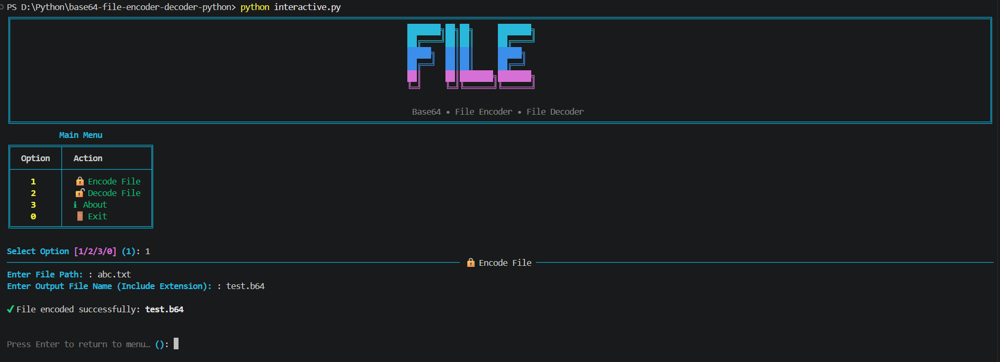
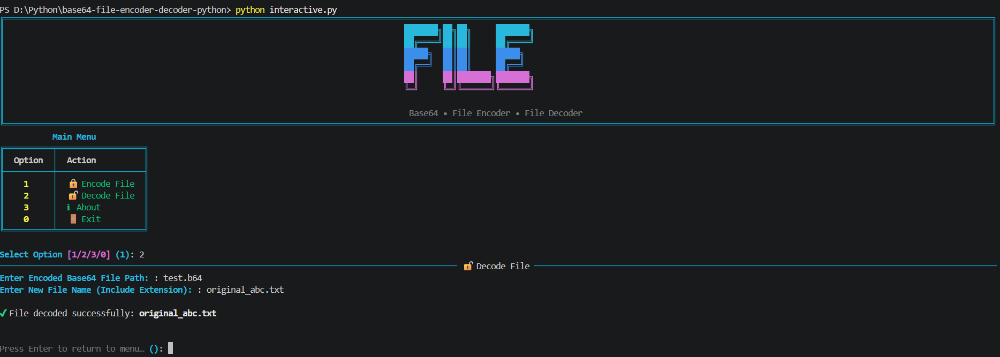
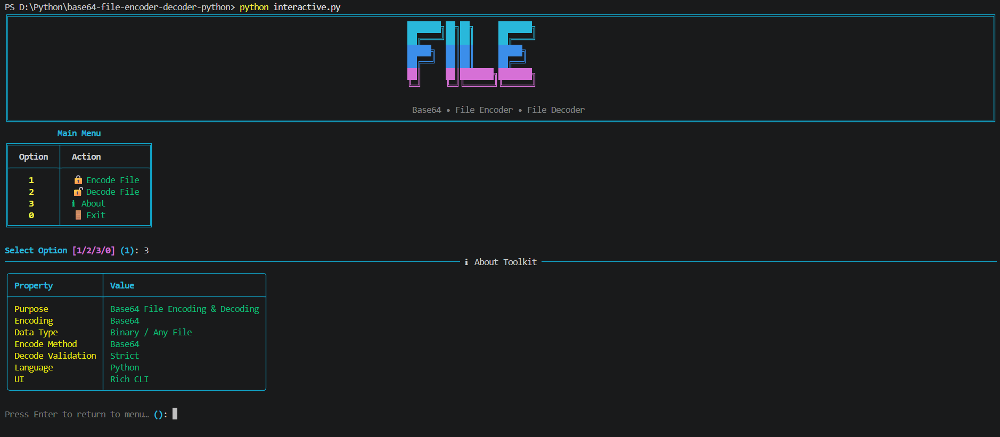
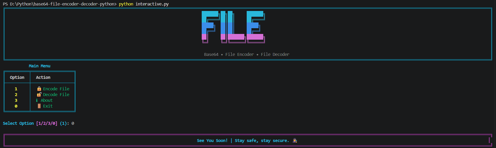

# 📄 Base64-File-Encoder-Decoder 🔐

A Python-based **Base64 File Encoder & Decoder** Command Line Tool that lets you **encode any file into Base64** and **decode it back into its original file**,right from your terminal.
This CLI tool is built for **learning encoding concepts**, **CTF practice**, and **safe file transfer/storage over text-only channels**, combining **simple no-dependency mode** with a **rich, colorful interactive CLI**.

---

## 🧱 Project Structure

```bash
base64-file-encoder-decoder-python/
│
├── assets/             # Screenshots
├── main.py             # Basic CLI application
├── interactive.py      # Rich CLI Version
├── requirements.txt    # Project Dependancies
├── LICENSE             # Project license
└── README.md           # Project documentation
```

---

## ✨ Features

### 🔒 Encoding

- Encodes **any file type** (binary or text) into Base64
- Reads the file in binary mode and writes the encoded output to a new file
- Works with images, documents, executables — any file format

### 🔓 Decoding

- Decodes a Base64-encoded file back into its **original file**
- Uses **strict validation** (`validate=True`) to catch corrupted or malformed Base64 data
- Clear, handled errors instead of silent failures or crashes

### 🎨 Rich CLI Interface

- Colored terminal output with a custom banner
- Structured **About** table showing tool properties
- Styled panels and dividers for encode/decode results
- Handles missing files, permission errors, and directory paths gracefully

### ⚡ Dual Mode Support

- 🧼 Basic CLI → Lightweight, no dependencies (`main.py`)
- 🎨 Rich CLI → Enhanced UI with colors, panels and menus (`interactive.py`)

---

## 🛠 Technologies Used

| Technology   | Purpose                        |
| ------------ | ------------------------------ |
| **Python 3** | Core language                  |
| **base64**   | File encoding & decoding logic |
| **pathlib**  | Safe file path handling        |
| **Rich**     | Interactive CLI interface      |

---

## ▶️ How to Run

### 1️⃣ Clone the repository

```bash
git clone https://github.com/ShakalBhau0001/base64-file-encoder-decoder-python.git
```

### 2️⃣ Enter the project directory

```bash
cd base64-file-encoder-decoder-python
```

### 3️⃣ Install Dependencies

```bash
pip install rich
```

**OR**

```bash
pip install -r requirements.txt
```

> ℹ️ The Basic CLI (`main.py`) needs **no external dependencies** — Rich is only required for `interactive.py`.

### 4️⃣ Running the Project

#### Basic CLI Version

```bash
python main.py
```

#### Rich Interactive Version

```bash
python interactive.py
```

---

## ▶️ Usage

### Basic CLI (`main.py`)

```bash
==================================================
        BASE64 - FILE ENCODER | DECODER
==================================================

[1] Encode
[2] Decode
[3] Exit

Enter your choice: 1
Enter File Path: photo.png
Enter Output File Name (Include Extension): photo_encoded.txt

File encoded successfully: photo_encoded.txt
```

```bash
Enter your choice: 2
Enter Encoded Base64 File Path: photo_encoded.txt
Enter New File Name (Include Extension): photo_restored.png

File decoded successfully: photo_restored.png
```

### Rich Interactive CLI (`interactive.py`)

```bash
[1] 🔒 Encode Text
[2] 🔓 Decode Text
[3] ℹ About
[0] 🚪 Exit

Select Option: 1
Enter File Path: secret.pdf
Enter Output File Name (Include Extension): secret_b64.txt

✔ File encoded successfully: secret_b64.txt
```

---

## 📁 Supported Input

- **Input File:** Any file type (`binary-safe — images, PDFs, zips, executables, etc.`)
- **Encoding:** Standard Base64 (`base64.b64encode` / `base64.b64decode`)
- **Decode Validation:** Strict, in both CLIs (`validate=True`)
- **Safety Check:** Input and output files must be different (`Rich CLI`)

> ⚠️ Encoding a file makes it noticeably larger (~33%) and outputs plain text — this is **encoding, not compression or encryption**.

---

## ⚙️ How It Works

**1️⃣ Encoding**

- Input file is read as **raw bytes** (`rb` mode)
- Bytes → converted to **Base64** using `base64.b64encode`
- Encoded bytes are written to the output file (`wb` mode)

**2️⃣ Decoding**

- Base64 file is read as bytes and validated
- Validated data → converted back to the **original bytes** using `base64.b64decode`
- Original bytes are written to the output file, restoring the file exactly

---

## ⚠️ Common Errors

- **Input file not found** → Raises a clear "file not found" error
- **Invalid/corrupted Base64 data** → Decode fails with a handled `ValueError`
- **Same input & output path** → Rejected to prevent overwriting the original file
- **Permission denied / directory path given** → Handled with a friendly error message

---

## 🌟 Future Enhancements

- Support for URL-safe Base64 (`urlsafe_b64encode` / `urlsafe_b64decode`)
- Progress indicator for large files
- Batch encode/decode for multiple files at once
- Optional compression before encoding
- Argument-based (non-interactive) CLI mode for automation

---

## 📦 Related Projects

This repository focuses on a **specific encoding technique** implemented
as a **command-line (CLI) learning project**.

The goal of this project is to:

- Understand how Base64 encoding works at the **file level**
- Practice encoding/decoding challenges commonly seen in **CTFs**
- Learn how simple CLI-based tools are structured

For more advanced, security-focused CLI tools, check out:

> 🔗 **[CLI Projects](https://github.com/stars/ShakalBhau0001/lists/cli-projects)**

---

## ⚠️ Disclaimer

> This project is intended for **educational and learning purposes only**.

> Base64 is an **encoding scheme, not encryption** — it does not provide any confidentiality or security, and should never be used to protect sensitive files.

---

## 📸 Preview

### 1. **Encode**



### 2. **Decode**



### 3. **About**



### 4. **Exit**



---

## 🪪 Author

> **Creator: Shakal Bhau**

> **GitHub: [ShakalBhau0001](https://github.com/ShakalBhau0001)**

---

## ⭐ Support

If you like this project, consider giving it a ⭐ on GitHub!

---
